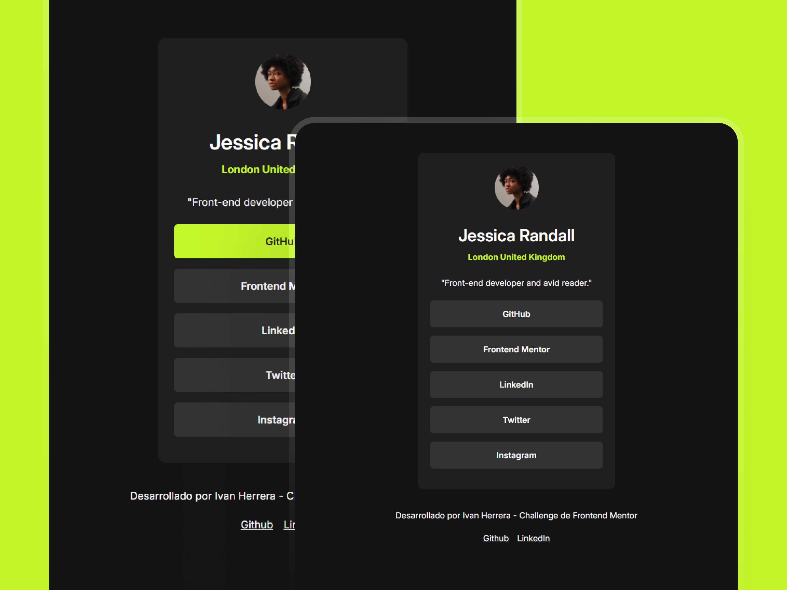
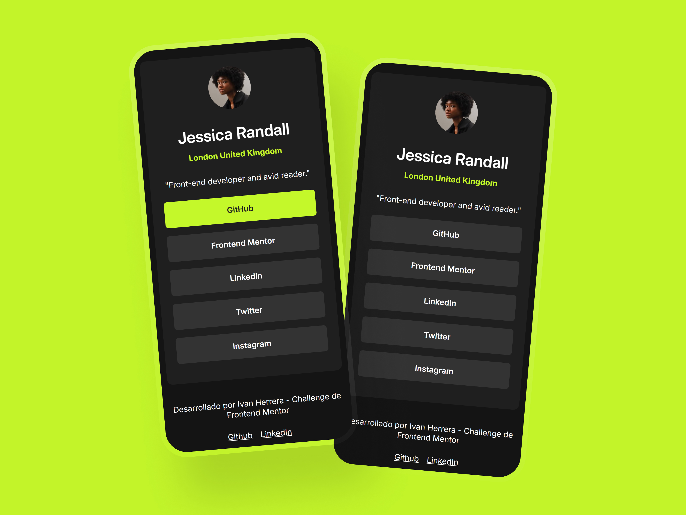

# Social links profile - Frontend Mentor Challenge  

  

## 📌 Description 

This is my solution to the **Social links profile** challenge from [Frontend Mentor](https://www.frontendmentor.io/challenges/social-links-profile-UG32l9m6dQ).

## 🚀 Technologies Used

- ✅ **HTML5**
- 🎨 **CSS3**

## 📸 Screenshot

  
  

## 📖 How to run it  

1. Clone repository:

   ```bash
   git clone https://github.com/ivanherreradev/frontendmentor-challenges.git
   cd 02-social-links-profile
   ```

2. Open the `index.html` in your browser or use Live Server in VSCode.

---

## 🔗 Links  

- 🔹 [Frontend Mentor - Social links profile Challenge](https://www.frontendmentor.io/challenges/social-links-profile-UG32l9m6dQ)  

📩 If you have feedback or suggestions, they are always welcome! 🚀